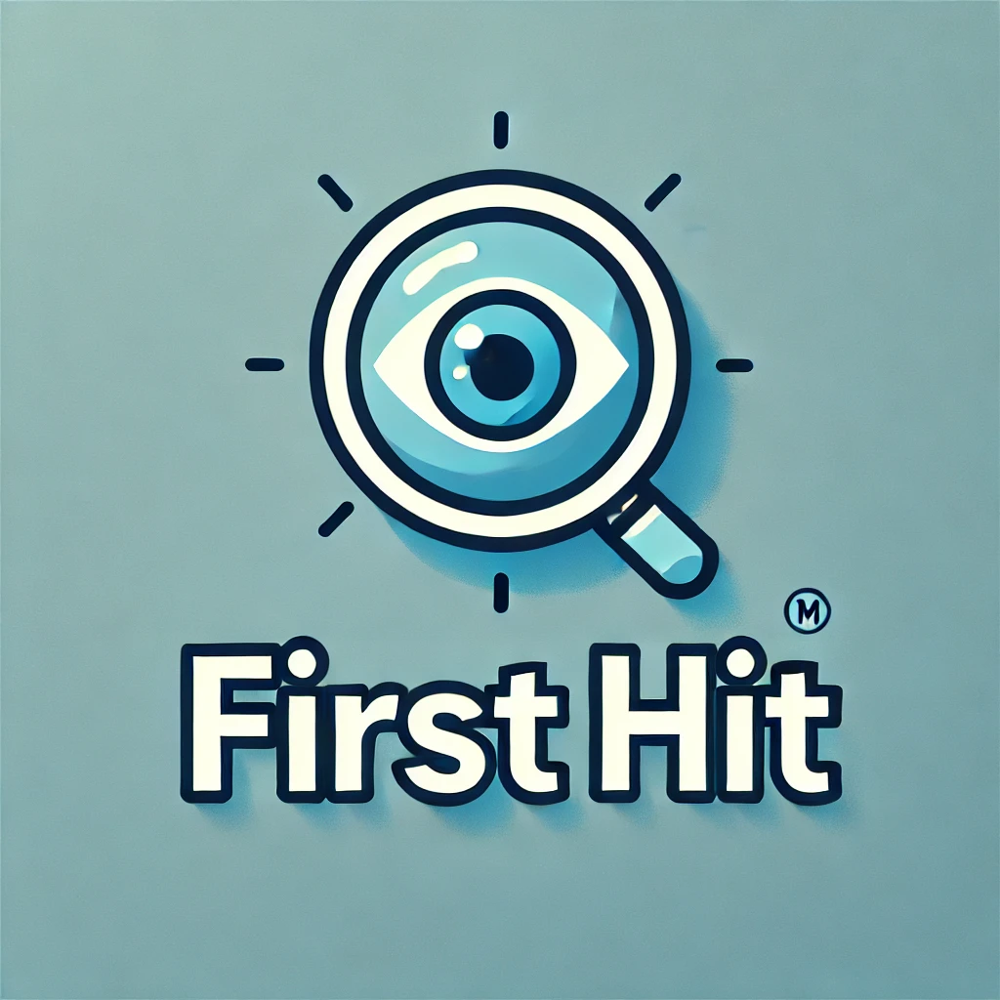

# サービス名: 『FIRST HIT』

 

# サービス概要
『FIRST HIT』は、出題される画像に対して、最も適した検索ワードを考え、そのワードが検索結果の何番目にヒットするかを競う画像検索ゲームです。
 
本サービスは、Unsplashというフリー画像サイトの素材と、OpenAIのAPIを活用した独自の画像検索機能を使用しています。

# サービスURL
### https://first-hit.com 
 

# サービス開発の背景
「まだ誰も作っていないような斬新なゲームを作りたい」という思いから、本サービスを開発しました。
日常的に使うことの多い画像検索という機能を、ゲームという形で楽しめるようにした、新感覚のサービスであると考えています。
 

初心者層に向けては、ユーザー登録なしでも手軽にプレイできるようにし、気軽にゲームを体験してもらえる設計にしています。
一方で上級者層に対しては、ユーザー登録によってスコアや成績を記録できるようにし、ランキング機能を通じて継続的に挑戦したくなる仕組みを提供します。
 
 
一般に公開されている画像検索APIの多くは精度が低く、だれでも気軽に使えるようなものがなかなか見つからず、実装には非常に苦労しました。
そこで本サービスでは、OpenAI APIを活用して、画像に対するキャプション生成と埋め込みベクトルの生成を行うことで、独自の高精度な画像検索機能を実現しています。
これにより、単なるキーワードマッチではなく、意味的なマッチングによる画像検索が可能となり、ゲームとしての精度や面白さも大きく向上しています。

# 機能紹介
| ユーザー登録 |
| :---: | 
|  |
| 
左上の「メニュー」から「ユーザー登録」を選択し、ユーザー登録画面に移動します。『メールアドレス』『ユーザー名（半角英数字のみ）』『パスワード』『パスワード確認』を入力してユーザー登録を行います。 または、画面右下の「Gログイン」を押すことでGoogleアカウントを使ってログインすることも可能です。|
   

| ログイン |
| :---: | 
|  |
| 
ユーザー登録を行うと自動的にログインされます。右上の表示でログイン中であるかを確認することができます。 ※ログイン中でない場合、「ランキング」には参加できませんのでご注意ください。
 |
 

| ゲーム開始 |
| :---: | 
|  |
| 
左上の「メニュー」から「プレイ」を選択するとゲームが始まります。第1問から第5問までの全5問あります。
 |
 

| ゲームの進め方① |
| :---: | 
|  |
| 
表示されている画像に合う検索ワードを考え、入力します。入力が完了したら「検索」を押します。
 |
 

| ゲームの進め方② |
| :---: | 
|  |
| 
検索結果が表示されます。先ほど表示された画像が何番目にヒットしたかを確認します。また、獲得した得点や検索結果上位10位の画像を確認することができます。 検索結果を確認したら次の問題へ進みます。
 |
 

| ゲーム終了 |
| :---: | 
|  |
| 
5問目まで終えたら、「結果を見る」を押し、結果を見ます。合計得点を確認することができます。 「Xに共有」を押すことで結果をシェアすることもできます。
 |
 

| ランキング |
| :---: | 
|  |
| 
「メニュー」の「ランキング」から全世界のランキングを確認することができます。自分の最高得点、順位に加えて全世界の上位10位の結果を確認できます。 ランキング参加にはログインが必要です。
 |
 

画面遷移図-figma: https://www.figma.com/design/MjKIqnr2Ew5b7Wxq3Ij4gh/%E5%8D%92%E6%A5%AD%E5%88%B6%E4%BD%9C?node-id=0-1&t=FgV82hne3m5tOgkA-1

ER図: 
